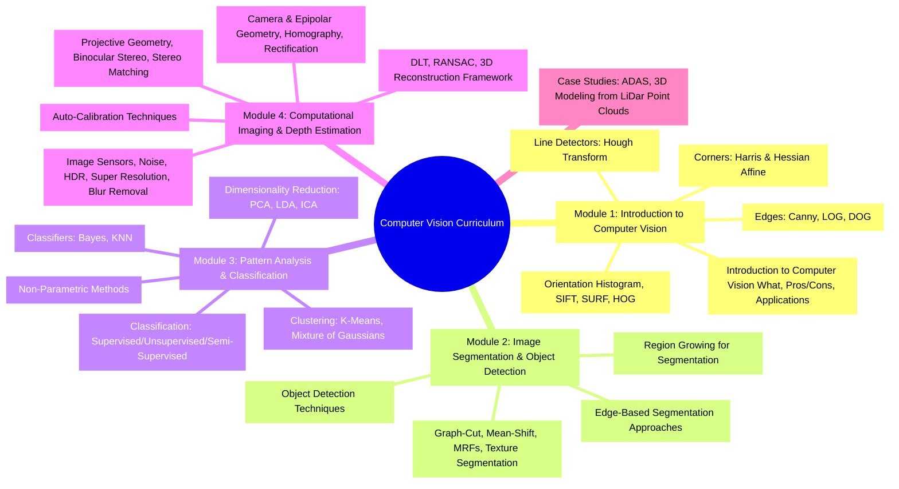

```mermaid
mindmap
  root((Computer Vision Curriculum))
    mod1_intro_cv[Module 1: Introduction to Computer Vision]
      concept_cv_intro[Introduction to Computer Vision What, Pros/Cons, Applications]
      concept_edges[Edges: Canny, LOG, DOG]
      concept_lines_hough[Line Detectors: Hough Transform]
      concept_corners[Corners: Harris & Hessian Affine]
      concept_orientation_hog[Orientation Histogram, SIFT, SURF, HOG]
    mod2_image_seg[Module 2: Image Segmentation & Object Detection]
      concept_seg_region_grow[Region Growing for Segmentation]
      concept_seg_edge_based[Edge-Based Segmentation Approaches]
      concept_seg_graph_cut[Graph-Cut, Mean-Shift, MRFs, Texture Segmentation]
      concept_obj_det[Object Detection Techniques]
    mod3_pattern_analysis[Module 3: Pattern Analysis & Classification]
      concept_clustering_km[Clustering: K-Means, Mixture of Gaussians]
      concept_classif_superv[Classification: Supervised/Unsupervised/Semi-Supervised]
      concept_classifiers_bayes_knn[Classifiers: Bayes, KNN]
      concept_dim_red_pca[Dimensionality Reduction: PCA, LDA, ICA]
      concept_nonparametric[Non-Parametric Methods]
    mod4_comp_imaging[Module 4: Computational Imaging & Depth Estimation]
      concept_comp_imaging_sensors[Image Sensors, Noise, HDR, Super Resolution, Blur Removal]
      concept_depth_estim_proj_geo[Projective Geometry, Binocular Stereo, Stereo Matching]
      concept_camera_epi[Camera & Epipolar Geometry, Homography, Rectification]
      concept_3d_recon_dlt_ransac[DLT, RANSAC, 3D Reconstruction Framework]
      concept_auto_calib[Auto-Calibration Techniques]
    case_study_adas_lidar[Case Studies: ADAS, 3D Modeling from LiDar Point Clouds]
```