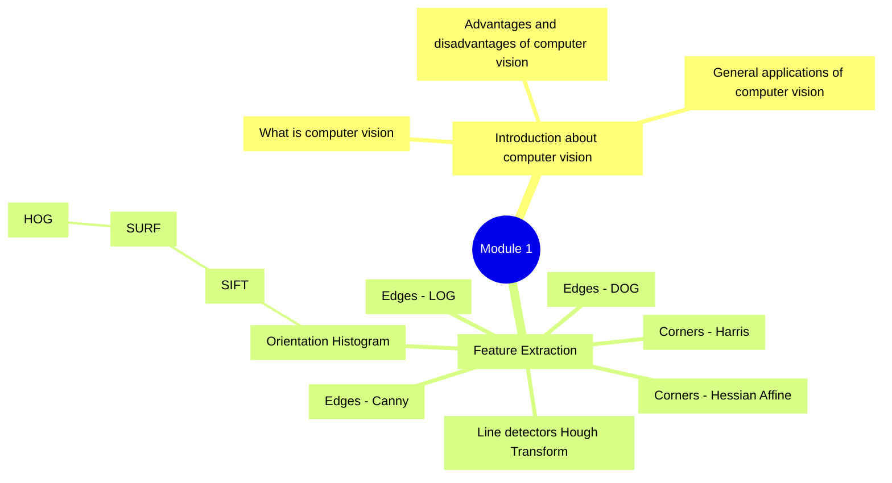

```mermaid
mindmap
  root((Module 1))
    intro_cv[Introduction about computer vision]
      what_is_cv[What is computer vision]
      advantages_disadvantages_cv[Advantages and disadvantages of computer vision]
      applications_cv[General applications of computer vision]
    feature_extraction[Feature Extraction]
      edges_canny[Edges - Canny]
      edges_log[Edges - LOG]
      edges_dog[Edges - DOG]
      line_detectors_hough[Line detectors Hough Transform]
      corners_harris[Corners - Harris]
      corners_hessian_affine[Corners - Hessian Affine]
      orientation_histogram[Orientation Histogram]
        sift[SIFT] 
          surf[SURF] 
            hog[HOG]
```