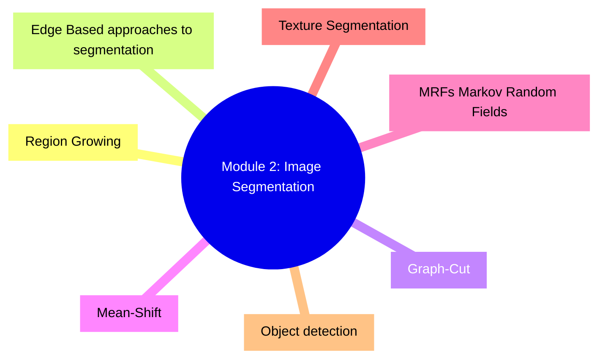

```mermaid
mindmap
root((Module 2: Image Segmentation))
  region_growing[Region Growing]
  edge_based[Edge Based approaches to segmentation]
  graph_cut[Graph-Cut]
  mean_shift[Mean-Shift]
  mrf[MRFs Markov Random Fields]
  texture_segmentation[Texture Segmentation]
  object_detection[Object detection]
```