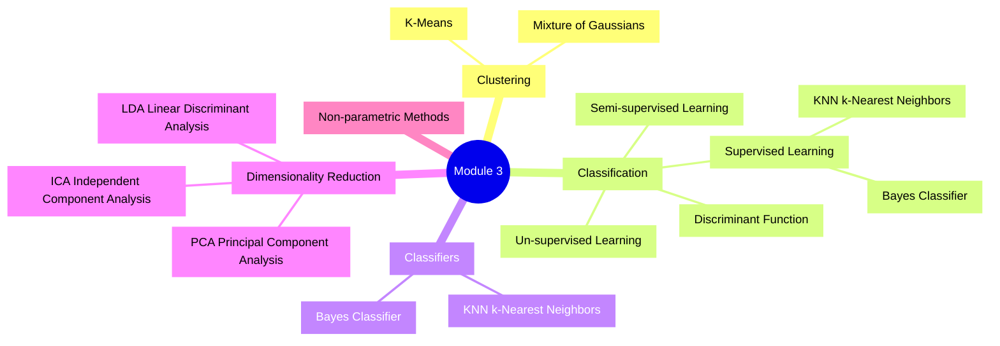

```mermaid
mindmap
root((Module 3))
    clustering[Clustering]
        k_means[K-Means]
        mixture_gaussians[Mixture of Gaussians]
    classification[Classification]
        discriminant_function[Discriminant Function]
        supervised_learning[Supervised Learning]
            bayes_classifier[Bayes Classifier]
            knn[KNN k-Nearest Neighbors]
        unsupervised_learning[Un-supervised Learning]
        semi_supervised_learning[Semi-supervised Learning]
    classifiers[Classifiers]
        bayes_classifier[Bayes Classifier]
        knn[KNN k-Nearest Neighbors]
    dimensionality_reduction[Dimensionality Reduction]
        pca[PCA Principal Component Analysis]
        lda[LDA Linear Discriminant Analysis]
        ica[ICA Independent Component Analysis]
    non_parametric_methods[Non-parametric Methods]
```