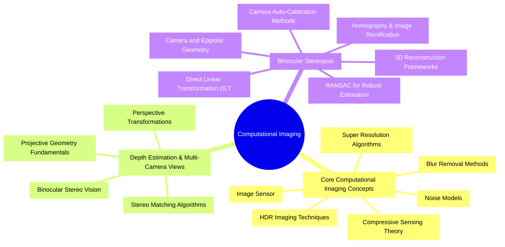

```mermaid
mindmap
  root((Computational Imaging))
    comp_imaging_core[Core Computational Imaging Concepts]
      image_sensor[Image Sensor]
      noise_models[Noise Models]
      hdr_techniques[HDR Imaging Techniques]
      super_resolution[Super Resolution Algorithms]
      blur_removal[Blur Removal Methods]
      compressive_sensing[Compressive Sensing Theory]
    depth_estimation[Depth Estimation & Multi-Camera Views]
      projective_geometry[Projective Geometry Fundamentals]
      binocular_stereo[Binocular Stereo Vision]
      stereo_matching[Stereo Matching Algorithms]
      perspective_transforms[Perspective Transformations]
    binocular_stereopsis[Binocular Stereopsis]
      epipolar_geometry[Camera and Epipolar Geometry]
      homography_rectification[Homography & Image Rectification]
      dlt_technique[Direct Linear Transformation DLT]
      ransac_algorithm[RANSAC for Robust Estimation]
      3d_recon_framework[3D Reconstruction Frameworks]
      auto_calibration[Camera Auto-Calibration Methods]
```