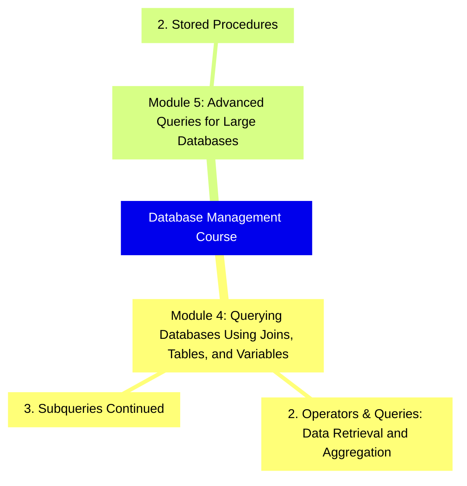

```mermaid
mindmap
course_root[Database Management Course]
  mod_4_db_querying[Module 4: Querying Databases Using Joins, Tables, and Variables]
    topic_operators_queries[2. Operators & Queries: Data Retrieval and Aggregation]
    topic_subqueries_continued[3. Subqueries Continued]
  mod_5_advanced_queries[Module 5: Advanced Queries for Large Databases]
    topic_stored_procedures[2. Stored Procedures]
```