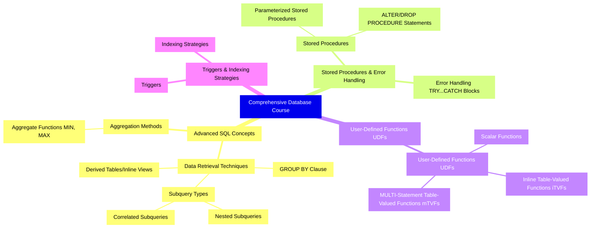

```mermaid
mindmap
  course_root[Comprehensive Database Course]
    mod_sql_advanced[Advanced SQL Concepts]
      concept_data_retrieval[Data Retrieval Techniques]
        subtopic_group_by[GROUP BY Clause]
        subtopic_subqueries[Subquery Types]
          subtopic_correlated[Correlated Subqueries]
          subtopic_nested[Nested Subqueries]
        subtopic_derived_tables[Derived Tables/Inline Views]
      concept_aggregation[Aggregation Methods]
        subtopic_agg_funcs[Aggregate Functions MIN, MAX]
    mod_procedures[Stored Procedures & Error Handling]
      concept_stored_procs[Stored Procedures]
        subtopic_param_procs[Parameterized Stored Procedures]
        subtopic_alter_drop[ALTER/DROP PROCEDURE Statements]
      subtopic_error_handling[Error Handling TRY...CATCH Blocks]
    mod_functions[User-Defined Functions UDFs]
      concept_udfs[User-Defined Functions UDFs]
        subtopic_scalar_funcs[Scalar Functions]
        subtopic_itvfvf[Inline Table-Valued Functions iTVFs]
        subtopic_mtvf[MULTI-Statement Table-Valued Functions mTVFs]
    mod_triggers[Triggers & Indexing Strategies]
      concept_triggers[Triggers]
      subtopic_indexing[Indexing Strategies]
```