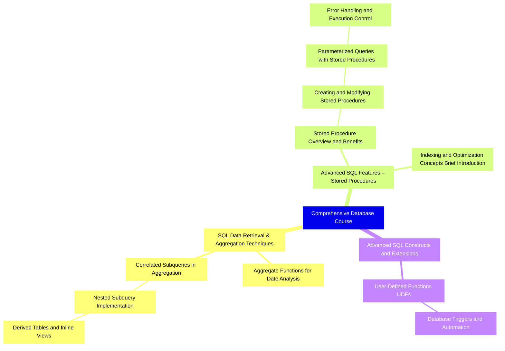

```mermaid
mindmap
course_root[Comprehensive Database Course]
  sql_data_retrieval_aggregation_techniques[SQL Data Retrieval & Aggregation Techniques]
    aggregate_functions_date_analysis[Aggregate Functions for Date Analysis]
    correlated_subqueries_aggregation[Correlated Subqueries in Aggregation]
      nested_subquery_implementation[Nested Subquery Implementation]
        derived_tables_inline_views[Derived Tables and Inline Views]
  advanced_sql_features_stored_procedures[Advanced SQL Features – Stored Procedures]
    stored_procedure_overview_benefits[Stored Procedure Overview and Benefits]
      creating_modifying_stored_procedures[Creating and Modifying Stored Procedures]
        parameterized_queries_sp[Parameterized Queries with Stored Procedures]
          error_handling_execution_control[Error Handling and Execution Control]
    indexing_optimization_concepts[Indexing and Optimization Concepts Brief Introduction]
  advanced_sql_constructs_extensions[Advanced SQL Constructs and Extensions]
    user_defined_functions_udfs[User-Defined Functions UDFs]
      database_triggers_automation[Database Triggers and Automation]
```