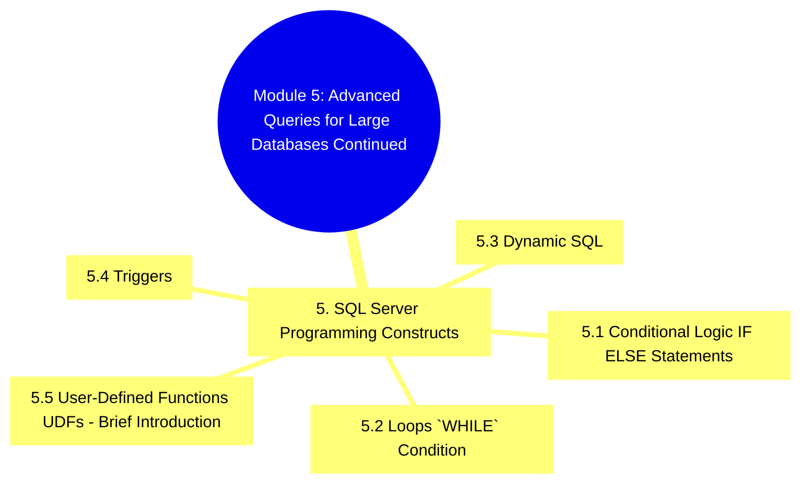

```mermaid  
mindmap
    mod_5_advanced_queries((Module 5: Advanced Queries for Large Databases Continued))  
      sql_server_programming[5. SQL Server Programming Constructs]  
        cond_logic[5.1 Conditional Logic IF ELSE Statements]  
        loops_while[5.2 Loops `WHILE` Condition]  
        dynamic_sql[5.3 Dynamic SQL]  
        triggers[5.4 Triggers]  
        udf_brief[5.5 User-Defined Functions UDFs - Brief Introduction]  
```