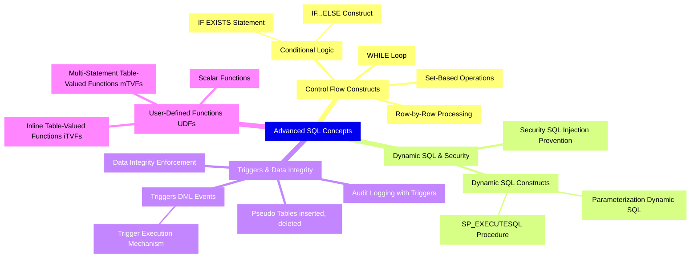

```mermaid
mindmap
  course_root[Advanced SQL Concepts]
    mod_control_flow[Control Flow Constructs]
      concept_cond_logic[Conditional Logic]
        concept_if_exists[IF EXISTS Statement]
        concept_if_else[IF...ELSE Construct]
      concept_while_loop[WHILE Loop]
      concept_row_processing[Row-by-Row Processing]
      concept_set_based[Set-Based Operations]
    mod_dynamic_sql[Dynamic SQL & Security]
      concept_dynamic_sql[Dynamic SQL Constructs]
        proc_sp_executesql[SP_EXECUTESQL Procedure]
        param_parametrization[Parameterization Dynamic SQL]
      security_sql_injection[Security SQL Injection Prevention]
    mod_triggers[Triggers & Data Integrity]
      trigger_dml_events[Triggers DML Events]
        concept_trigger_exec[Trigger Execution Mechanism]
      pseudo_inserted_deleted[Pseudo Tables inserted, deleted]
      audit_logging[Audit Logging with Triggers]
      data_integrity[Data Integrity Enforcement]
    mod_udfs[User-Defined Functions UDFs]
      udf_itvf[Inline Table-Valued Functions iTVFs]
      udf_mtvf[Multi-Statement Table-Valued Functions mTVFs]
      udf_scalar[Scalar Functions]
```