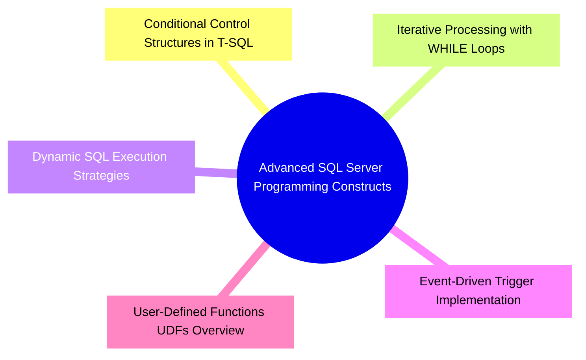

```mermaid
mindmap
  advanced_sql_root((Advanced SQL Server Programming Constructs))
    conditional_control[Conditional Control Structures in T-SQL]
    iterative_processing[Iterative Processing with WHILE Loops]
    dynamic_sql_strategies[Dynamic SQL Execution Strategies]
    event_driven_triggers[Event-Driven Trigger Implementation]
    udfs_overview[User-Defined Functions UDFs Overview]
```