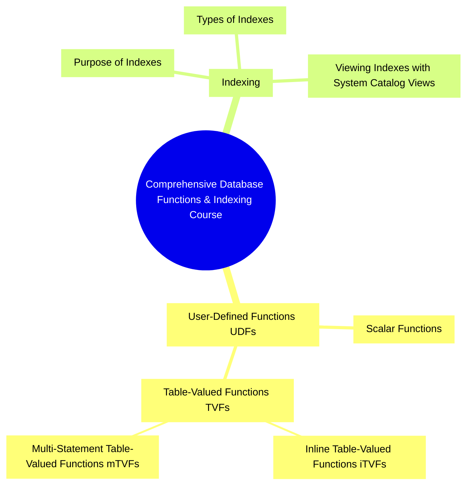

```mermaid
mindmap
  course_root((Comprehensive Database Functions & Indexing Course))
    udfs_prerequisite[User-Defined Functions UDFs]
      scalar_functions_seq[Scalar Functions]
      tvf_adv_app[Table-Valued Functions TVFs]
        itvf_concept_support[Inline Table-Valued Functions iTVFs]
        mtvf_seq[Multi-Statement Table-Valued Functions mTVFs]
    indexing_prerequisite[Indexing]
      purpose_of_indexes_concept_support[Purpose of Indexes]
      types_of_indexes_adv_app[Types of Indexes]
      viewing_catalog_views_seq[Viewing Indexes with System Catalog Views]
```