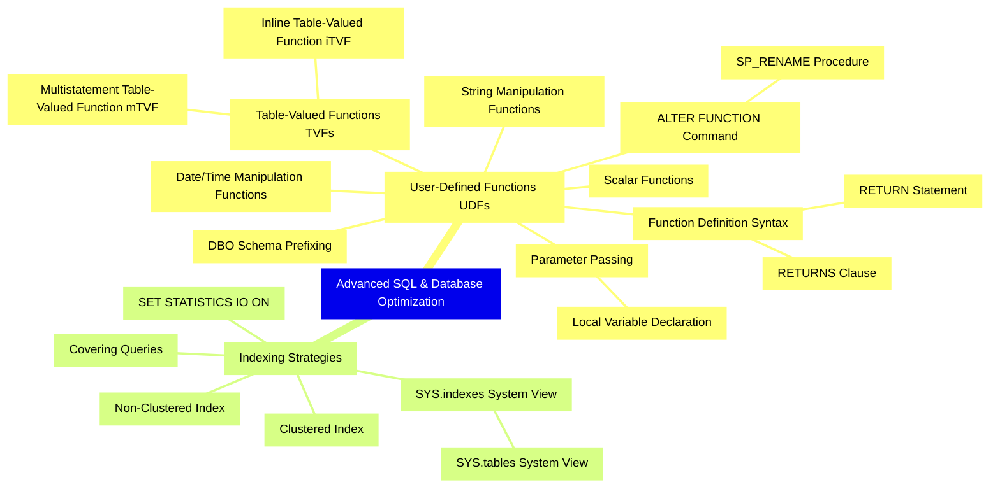

```mermaid
mindmap
course_root[Advanced SQL & Database Optimization]
    mod_udfs[User-Defined Functions UDFs]
        concept_scalar_func[Scalar Functions]
        concept_tvf[Table-Valued Functions TVFs]
            sub_itvf[Inline Table-Valued Function iTVF]
            sub_mtvf[Multistatement Table-Valued Function mTVF]
        syntax_func_def[Function Definition Syntax]
            clause_returns[RETURNS Clause]
            stmt_return[RETURN Statement]
        param_passing[Parameter Passing]
            var_declare[Local Variable Declaration]
        func_string[String Manipulation Functions]
        func_datetime[Date/Time Manipulation Functions]
        schema_dbo[DBO Schema Prefixing]
        alter_func[ALTER FUNCTION Command]
            rename_proc[SP_RENAME Procedure]
    mod_indexing[Indexing Strategies]
        index_clustered[Clustered Index]
        index_nonclustered[Non-Clustered Index]
        stats_io[SET STATISTICS IO ON]
        query_covering[Covering Queries]
        sys_indexes[SYS.indexes System View]
            sys_tables[SYS.tables System View]
```