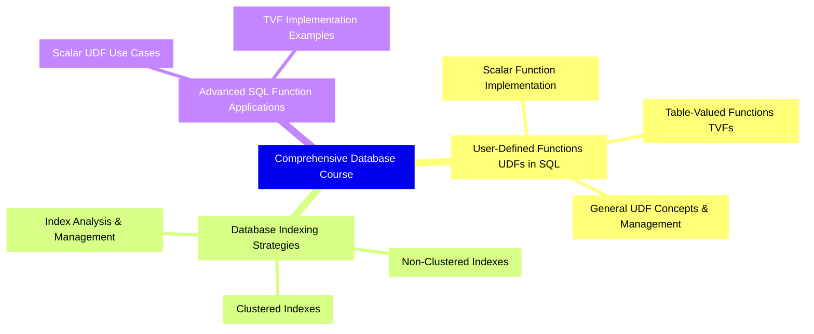

```mermaid
mindmap
  course_root[Comprehensive Database Course]
    mod_udfs_sql[User-Defined Functions UDFs in SQL]
      subtopic_scalar_func[Scalar Function Implementation]
      subtopic_tvf[Table-Valued Functions TVFs]
      subtopic_general_udf_concepts[General UDF Concepts & Management]
    mod_indexing_strategies[Database Indexing Strategies]
      subtopic_clustered_indexes[Clustered Indexes]
      subtopic_nonclustered_indexes[Non-Clustered Indexes]
      subtopic_index_analysis[Index Analysis & Management]
    mod_advanced_sql_apps[Advanced SQL Function Applications]
      subtopic_scalar_use_cases[Scalar UDF Use Cases]
      subtopic_tvf_implementation[TVF Implementation Examples]
```