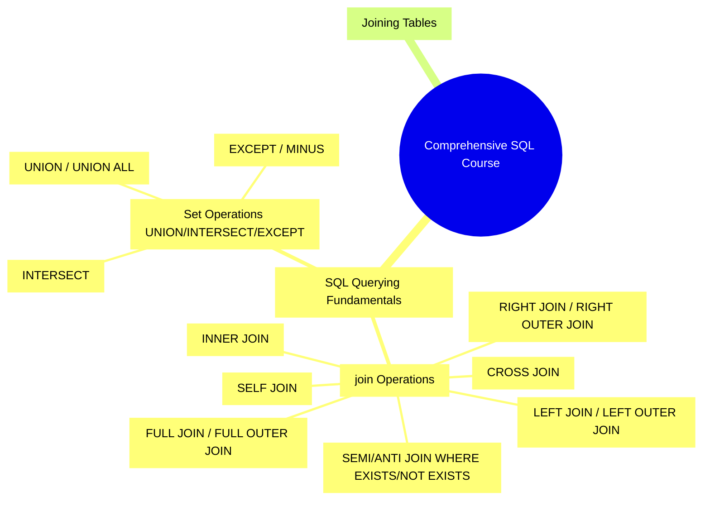

```mermaid
mindmap
  root((Comprehensive SQL Course))
    mod_sql_querying[SQL Querying Fundamentals]
      subtopic_joins[join Operations]
        inner_join[INNER JOIN]
        left_outer_join[LEFT JOIN / LEFT OUTER JOIN]
        right_outer_join[RIGHT JOIN / RIGHT OUTER JOIN]
        full_outer_join[FULL JOIN / FULL OUTER JOIN]
        cross_join[CROSS JOIN]
        self_join[SELF JOIN]
        semi_anti_join[SEMI/ANTI JOIN WHERE EXISTS/NOT EXISTS]
      subtopic_set_ops[Set Operations UNION/INTERSECT/EXCEPT]
        union_ops[UNION / UNION ALL]
        intersect_op[INTERSECT]
        except_minus_op[EXCEPT / MINUS]
    concept_joining_tables[Joining Tables]  
```