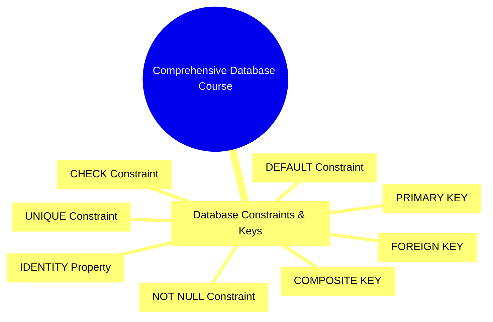

```mermaid
mindmap
  course_root((Comprehensive Database Course))
    mod_database_constraints[Database Constraints & Keys]
      concept_not_null[NOT NULL Constraint]
      concept_unique[UNIQUE Constraint]
      concept_primary_key[PRIMARY KEY]
      concept_foreign_key[FOREIGN KEY]
      concept_composite_key[COMPOSITE KEY]
      concept_check[CHECK Constraint]
      concept_default[DEFAULT Constraint]
      concept_identity[IDENTITY Property]
```