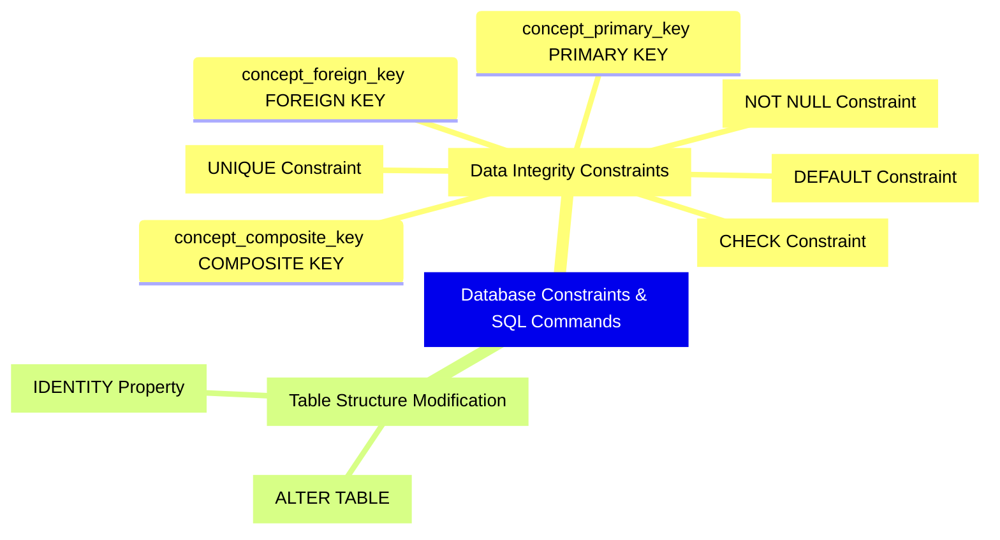

```mermaid
mindmap
  course_root[Database Constraints & SQL Commands]
    mod_constraints[Data Integrity Constraints]
      concept_not_null[NOT NULL Constraint]
      concept_unique[UNIQUE Constraint]
      concept_check[CHECK Constraint]
      concept_default[DEFAULT Constraint]
      concept_primary_key PRIMARY KEY
      concept_foreign_key FOREIGN KEY
      concept_composite_key COMPOSITE KEY
    mod_table_modification[Table Structure Modification]
      concept_identity[IDENTITY Property]
      command_alter_table[ALTER TABLE]
```