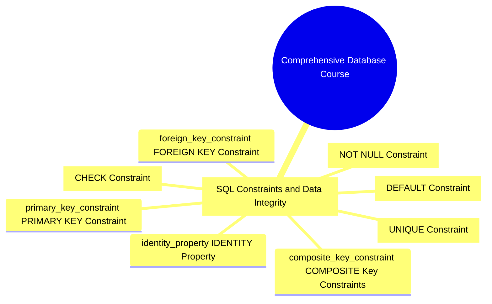

```mermaid
mindmap
  course_root((Comprehensive Database Course))
    mod_sql_constraints[SQL Constraints and Data Integrity]
      not_null_constraint[NOT NULL Constraint]
      unique_constraint[UNIQUE Constraint]
      check_constraint[CHECK Constraint]
      default_constraint[DEFAULT Constraint]
      primary_key_constraint PRIMARY KEY Constraint
      foreign_key_constraint FOREIGN KEY Constraint
      composite_key_constraint COMPOSITE Key Constraints
      identity_property IDENTITY Property
```