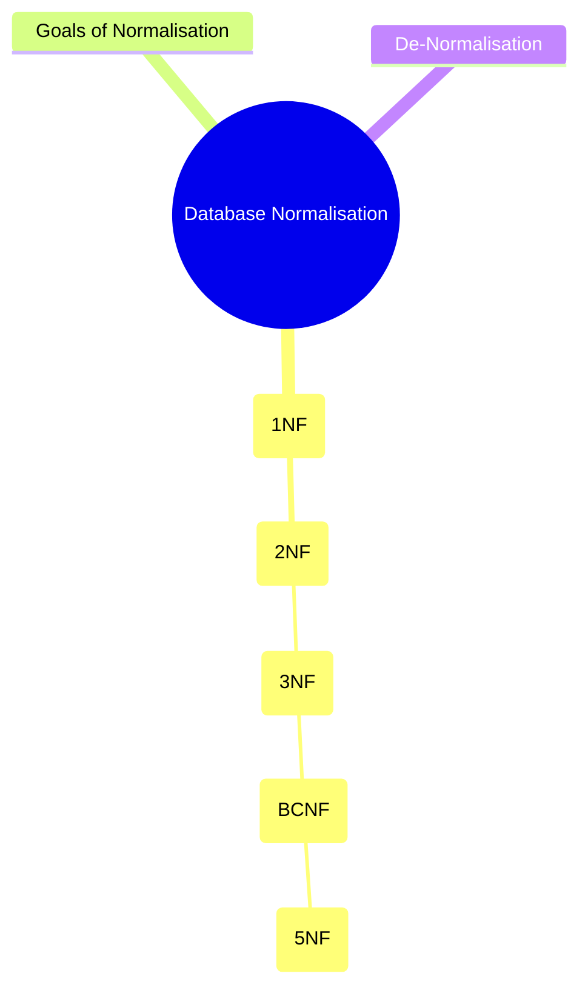

```mermaid
mindmap
  root((Database Normalisation))
    1st Normal Form (1NF)
      2nd Normal Form (2NF)
        3rd Normal Form (3NF)
          Boyce-Codd Normal Form (BCNF)
            4th Normal Form 4NF and 5th Normal Form (5NF)
    Goals of Normalisation
    De-Normalisation
```