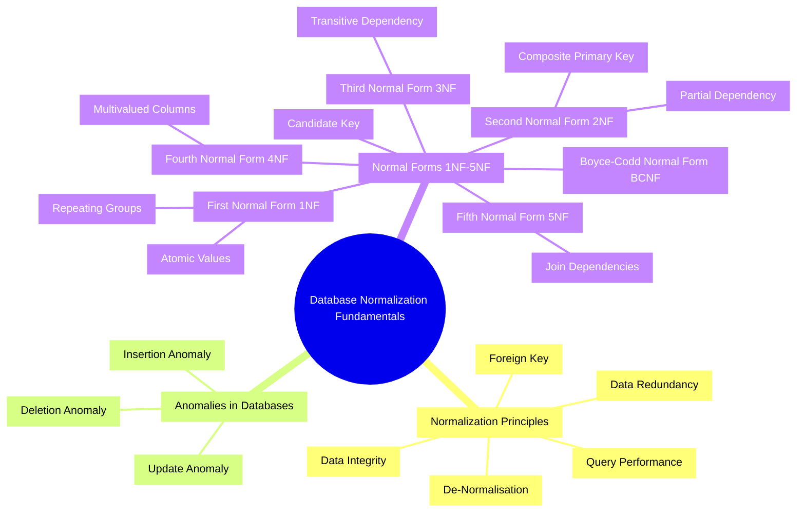

```mermaid
mindmap
    root((Database Normalization Fundamentals))
        mod_normalization_principles[Normalization Principles]
            concept_data_redundancy[Data Redundancy]
            concept_query_performance[Query Performance]
            concept_data_integrity[Data Integrity]
            concept_foreign_key[Foreign Key]
            concept_denormalisation[De-Normalisation]
        mod_anomalies[Anomalies in Databases]
            concept_insertion_anomaly[Insertion Anomaly]
            concept_update_anomaly[Update Anomaly]
            concept_deletion_anomaly[Deletion Anomaly]
        mod_normal_forms[Normal Forms 1NF-5NF]
            form_1nf[First Normal Form 1NF]
                concept_atomic_values[Atomic Values]
                concept_repeating_groups[Repeating Groups]
            form_2nf[Second Normal Form 2NF]
                concept_composite_primary_key[Composite Primary Key]
                concept_partial_dependency[Partial Dependency]
            form_3nf[Third Normal Form 3NF]
                concept_transitive_dependency[Transitive Dependency]
            form_bcnf[Boyce-Codd Normal Form BCNF]
            form_4nf[Fourth Normal Form 4NF]
                concept_multi_valued_columns[Multivalued Columns]
            form_5nf[Fifth Normal Form 5NF]
                concept_join_dependencies[Join Dependencies]
            concept_candidate_key[Candidate Key]
```