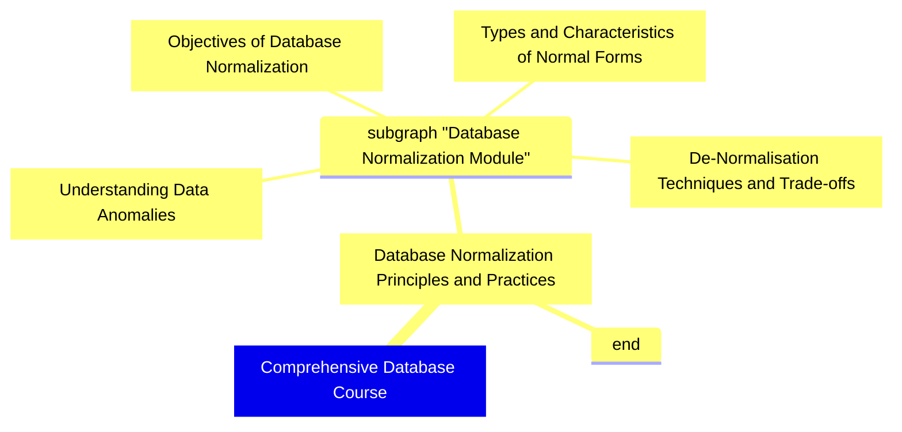

```mermaid
mindmap
  course_root[Comprehensive Database Course]
    --> mod_norm_principles[Database Normalization Principles and Practices]
        subgraph "Database Normalization Module"
            concept_anomalies[Understanding Data Anomalies]
            concept_obj_dbnorm[Objectives of Database Normalization]
            concept_nform_types[Types and Characteristics of Normal Forms]
            concept_denorm[De-Normalisation Techniques and Trade-offs]
        end
```