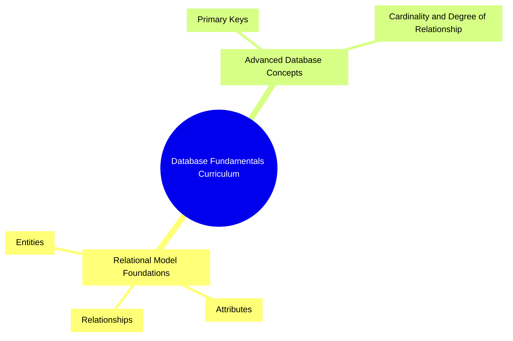

```mermaid
mindmap
  course_root((Database Fundamentals Curriculum))
    mod_rel_model[Relational Model Foundations]
      concept_entities[Entities]
      concept_attributes[Attributes]
      concept_relationships[Relationships]
    mod_advanced_concepts[Advanced Database Concepts]
      concept_primary_keys[Primary Keys]
      concept_cardinality[Cardinality and Degree of Relationship]
```