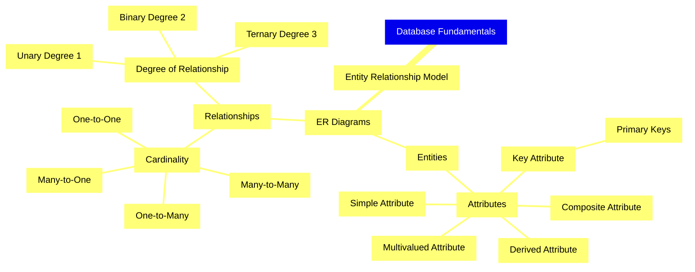

```mermaid
mindmap
  course_root[Database Fundamentals]
    mod_erm[Entity Relationship Model]
      er_diagrams[ER Diagrams]
        entities[Entities]
          attributes[Attributes]
            key_attribute[Key Attribute]
              primary_keys[Primary Keys]
            simple_attr[Simple Attribute]
            composite_attr[Composite Attribute]
            multi_valued_attr[Multivalued Attribute]
            derived_attr[Derived Attribute]
        relationships[Relationships]
          cardinality[Cardinality]
            one_to_one[One-to-One]
            one_to_many[One-to-Many]
            many_to_one[Many-to-One]
            many_to_many[Many-to-Many]
          degree_relationship[Degree of Relationship]
            unary_deg[Unary Degree 1]
            binary_deg[Binary Degree 2]
            ternary_deg[Ternary Degree 3]
```