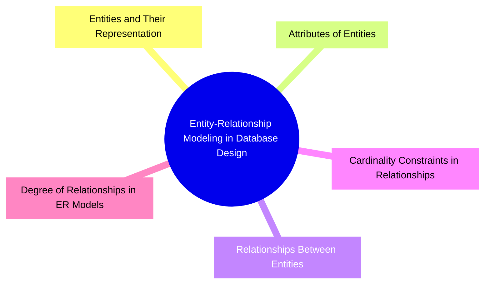

```mermaid
mindmap
  root((Entity-Relationship Modeling in Database Design))
    sub_er_entities[Entities and Their Representation]
    sub_er_attributes[Attributes of Entities]
    sub_er_relationships[Relationships Between Entities]
    sub_er_cardinality[Cardinality Constraints in Relationships]
    sub_er_degree[Degree of Relationships in ER Models]
```