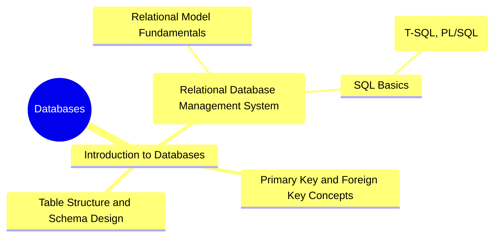

```mermaid
mindmap
  root((Databases))
    Introduction to Databases
      RDBMS (Relational Database Management System)
        Relational Model Fundamentals
        SQL Basics
          SQL Dialects (T-SQL, PL/SQL)
      Table Structure and Schema Design
      Primary Key and Foreign Key Concepts
```