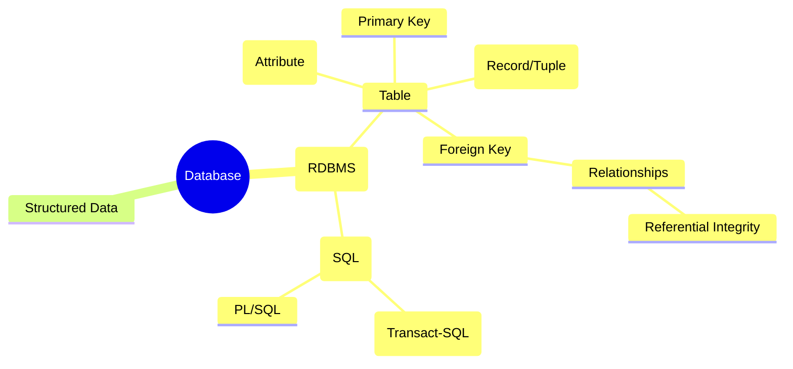

```mermaid
mindmap
root((Database))
    Relational Database Management System (RDBMS)
        Table
            Column (Attribute)
            Row (Record/Tuple)
            Primary Key
            Foreign Key
                Relationships
                    Referential Integrity
        Structured Query Language (SQL)
            T-SQL (Transact-SQL)
            PL/SQL
    Structured Data
```