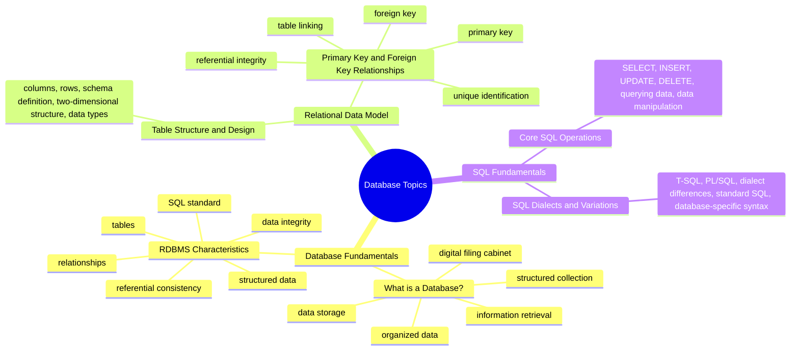

```mermaid
mindmap
root((Database Topics))
    Database Fundamentals
        What is a Database?
            data storage
            structured collection
            information retrieval
            digital filing cabinet
            organized data
        RDBMS Characteristics
            tables
            relationships
            SQL standard
            data integrity
            structured data
            referential consistency

    Relational Data Model
        Table Structure and Design
            columns, rows, schema definition, two-dimensional structure, data types
        Primary Key and Foreign Key Relationships
            primary key
            foreign key
            referential integrity
            unique identification
            table linking

    SQL Fundamentals
        Core SQL Operations
            SELECT, INSERT, UPDATE, DELETE, querying data, data manipulation
        SQL Dialects and Variations
            T-SQL, PL/SQL, dialect differences, standard SQL, database-specific syntax
```