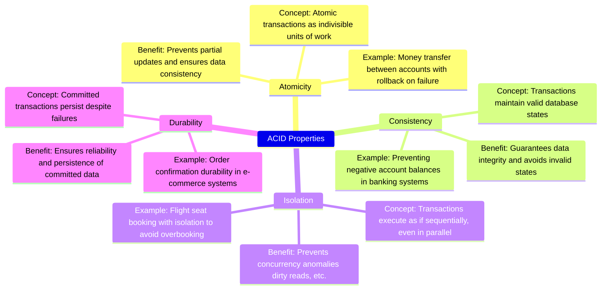

```mermaid
mindmap
  ACID Properties
    Atomicity 
      Concept: Atomic transactions as indivisible units of work
      Example: Money transfer between accounts with rollback on failure
      Benefit: Prevents partial updates and ensures data consistency
    Consistency
      Concept: Transactions maintain valid database states
      Example: Preventing negative account balances in banking systems
      Benefit: Guarantees data integrity and avoids invalid states
    Isolation
      Concept: Transactions execute as if sequentially, even in parallel
      Example: Flight seat booking with isolation to avoid overbooking
      Benefit: Prevents concurrency anomalies dirty reads, etc.
    Durability
      Concept: Committed transactions persist despite failures
      Example: Order confirmation durability in e-commerce systems
      Benefit: Ensures reliability and persistence of committed data
```