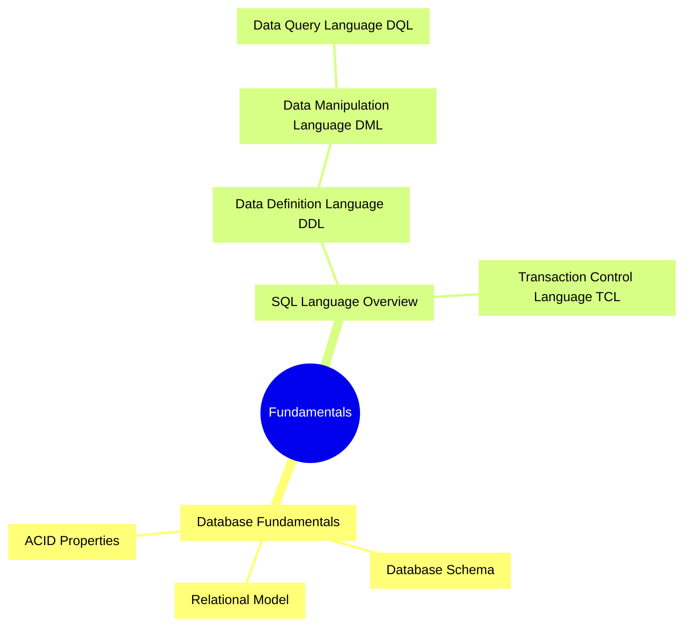

```mermaid
mindmap
root((Fundamentals))
    mod_database_fundamentals[Database Fundamentals]
        concept_relational_model[Relational Model]
        concept_db_schema[Database Schema]
        concept_acid_props[ACID Properties]
    mod_sql_language[SQL Language Overview]
        subtopic_ddl[Data Definition Language DDL]
            subtopic_dml[Data Manipulation Language DML]
                subtopic_dql[Data Query Language DQL]
        subtopic_tcl[Transaction Control Language TCL]
```