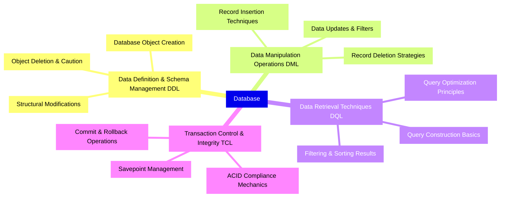

```mermaid
mindmap
  course_root[Database]
    mod_ddl[Data Definition & Schema Management DDL]
      sub_ddl_create[Database Object Creation]
      sub_ddl_modify[Structural Modifications]
      sub_ddl_delete[Object Deletion & Caution]
    mod_dml[Data Manipulation Operations DML]
      sub_dml_insert[Record Insertion Techniques]
      sub_dml_update[Data Updates & Filters]
      sub_dml_delete[Record Deletion Strategies]
    mod_dql[Data Retrieval Techniques DQL]
      sub_dql_query[Query Construction Basics]
      sub_dql_filter[Filtering & Sorting Results]
      sub_dql_optimize[Query Optimization Principles]
    mod_tcl[Transaction Control & Integrity TCL]
      sub_tcl_acid[ACID Compliance Mechanics]
      sub_tcl_commit[Commit & Rollback Operations]
      sub_tcl_savepoint[Savepoint Management]
```