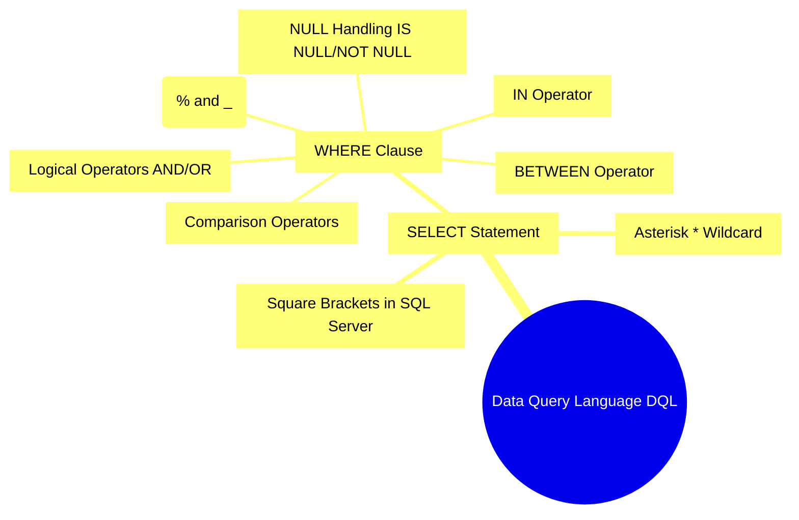

```mermaid
mindmap
root((Data Query Language DQL))
  select_statement[SELECT Statement]
    where_clause[WHERE Clause]
      comparison_operators[Comparison Operators]
      logical_operators[Logical Operators AND/OR]
      in_operator[IN Operator]
      between_operator[BETWEEN Operator]
      like_wildcards LIKE Operator with Wildcards (% and _)
      null_handling[NULL Handling IS NULL/NOT NULL]
    asterisk_wildcard[Asterisk * Wildcard]
    sql_server_brackets[Square Brackets in SQL Server]
```