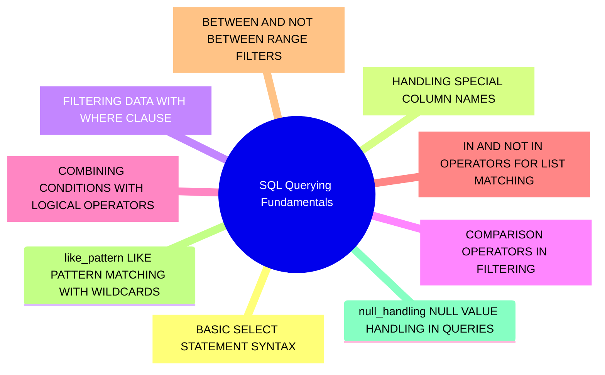

```mermaid
mindmap
root((SQL Querying Fundamentals))
    select_syntax[BASIC SELECT STATEMENT SYNTAX]
    special_columns[HANDLING SPECIAL COLUMN NAMES]
    where_clause[FILTERING DATA WITH WHERE CLAUSE]
    comparison_ops[COMPARISON OPERATORS IN FILTERING]
    logical_ops[COMBINING CONDITIONS WITH LOGICAL OPERATORS]
    in_not_in[IN AND NOT IN OPERATORS FOR LIST MATCHING]
    between_ops[BETWEEN AND NOT BETWEEN RANGE FILTERS]
    like_pattern LIKE PATTERN MATCHING WITH WILDCARDS
    null_handling NULL VALUE HANDLING IN QUERIES
```