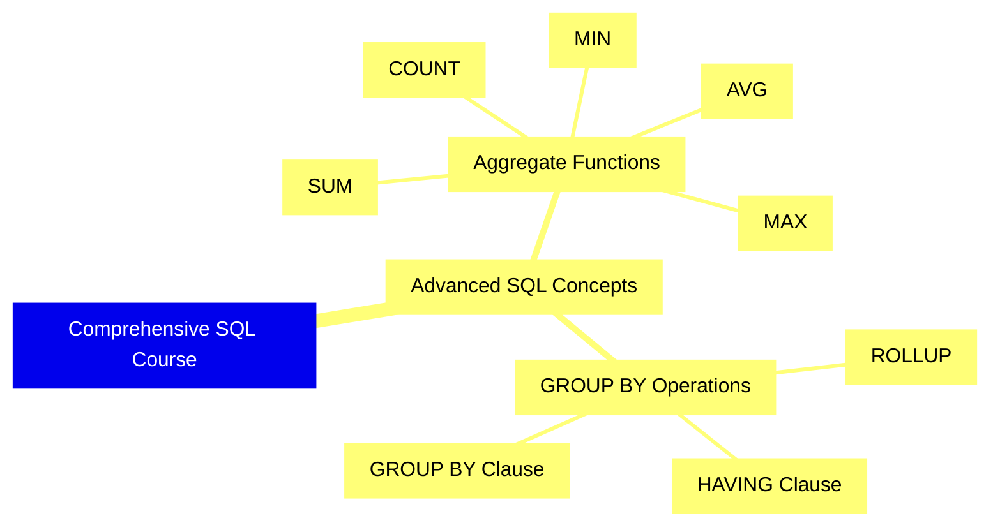

```mermaid
mindmap
  course_root[Comprehensive SQL Course]
    mod_sql_advanced[Advanced SQL Concepts]
      section_aggregate_funcs[Aggregate Functions]
        func_count[COUNT]
        func_sum[SUM]
        func_avg[AVG]
        func_max[MAX]
        func_min[MIN]
      section_group_by_ops[GROUP BY Operations]
        clause_group_by[GROUP BY Clause]
        clause_having[HAVING Clause]
        operator_rollup[ROLLUP]
```