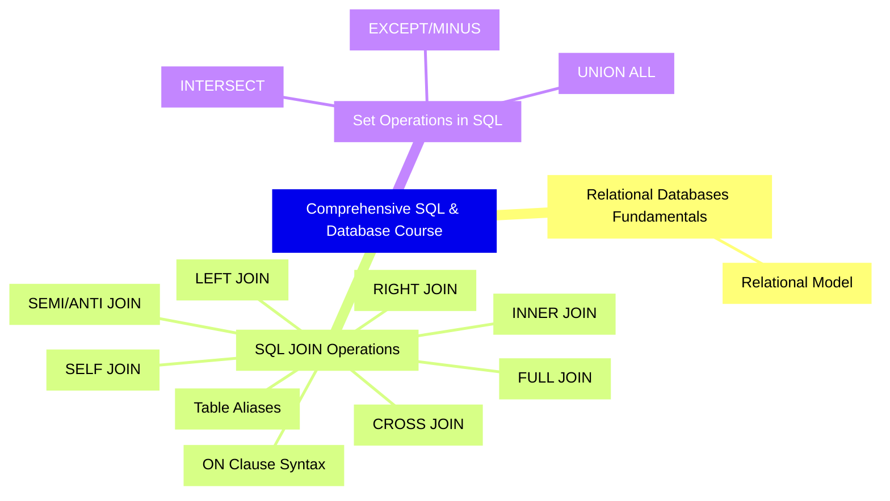

```mermaid
mindmap
course_root[Comprehensive SQL & Database Course]
    mod_relational_db[Relational Databases Fundamentals]
        concept_rel_model[Relational Model]
    mod_sql_joins[SQL JOIN Operations]
        concept_table_aliases[Table Aliases]
        concept_on_clause[ON Clause Syntax]
        subtopic_inner_join[INNER JOIN]
        subtopic_left_join[LEFT JOIN]
        subtopic_right_join[RIGHT JOIN]
        subtopic_full_join[FULL JOIN]
        subtopic_cross_join[CROSS JOIN]
        subtopic_self_join[SELF JOIN]
        subtopic_semi_anti[SEMI/ANTI JOIN]
    mod_set_ops[Set Operations in SQL]
        subtopic_union_all[UNION ALL]
        subtopic_intersect[INTERSECT]
        subtopic_except_minus[EXCEPT/MINUS]
```