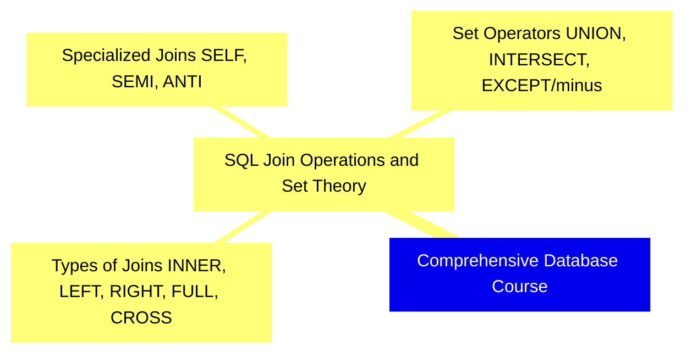

```mermaid
mindmap
  course_root[Comprehensive Database Course]
    mod_sql_joins_set_theory[SQL Join Operations and Set Theory]
      subtopic_types_of_joins[Types of Joins INNER, LEFT, RIGHT, FULL, CROSS]
      subtopic_specialized_joins[Specialized Joins SELF, SEMI, ANTI]
      subtopic_set_operators[Set Operators UNION, INTERSECT, EXCEPT/minus]
```