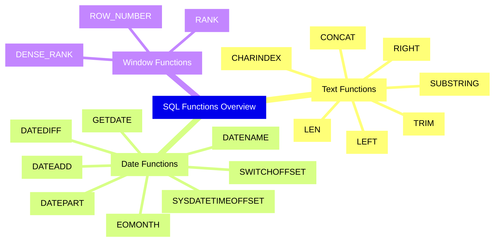

```mermaid
mindmap
  course_root[SQL Functions Overview]
    node_text_functions[Text Functions]
      func_len[LEN]
      func_left[LEFT]
      func_right[RIGHT]
      func_substring[SUBSTRING]
      func_charindex[CHARINDEX]
      func_concat[CONCAT]
      func_trim[TRIM]
    node_date_functions[Date Functions]
      func_datepart[DATEPART]
      func_datename[DATENAME]
      func_datediff[DATEDIFF]
      func_dateadd[DATEADD]
      func_eomonth[EOMONTH]
      func_getdate[GETDATE]
      func_sysdatetimeoffset[SYSDATETIMEOFFSET]
      func_switchoffset[SWITCHOFFSET]
    node_window_functions[Window Functions]
      func_rank[RANK]
      func_denserank[DENSE_RANK]
      func_rownumber[ROW_NUMBER]
```