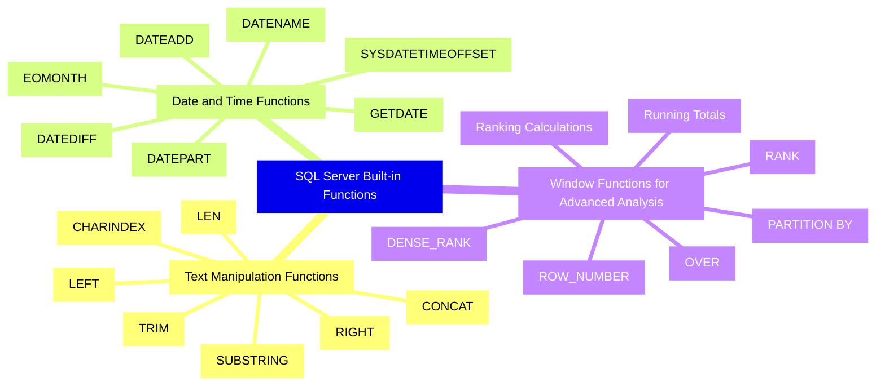

```mermaid
mindmap
  sql_built_in_functions[SQL Server Built-in Functions]
    text_manipulation[Text Manipulation Functions]
      len_func[LEN]
      left_func[LEFT]
      right_func[RIGHT]
      substring_func[SUBSTRING]
      charindex_func[CHARINDEX]
      concat_func[CONCAT]
      trim_func[TRIM]
    date_time_functions[Date and Time Functions]
      datepart_func[DATEPART]
      datename_func[DATENAME]
      datediff_func[DATEDIFF]
      dateadd_func[DATEADD]
      eomonth_func[EOMONTH]
      getdate_func[GETDATE]
      sysdatetimeoffset_func[SYSDATETIMEOFFSET]
    window_analysis[Window Functions for Advanced Analysis]
      rank_func[RANK]
      dense_rank_func[DENSE_RANK]
      row_number_func[ROW_NUMBER]
      partition_by[PARTITION BY]
      over_clause[OVER]
      running_totals[Running Totals]
      ranking_calculations[Ranking Calculations]
```