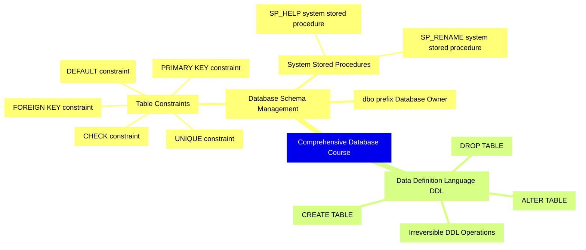

```mermaid
mindmap
  course_root[Comprehensive Database Course]
    mod_schema_mgmt[Database Schema Management]
      sec_constraints[Table Constraints]
        constr_primary_key[PRIMARY KEY constraint]
        constr_foreign_key[FOREIGN KEY constraint]
        constr_check[CHECK constraint]
        constr_unique[UNIQUE constraint]
        constr_default(DEFAULT constraint)
      subtopic_system_procs[System Stored Procedures]
        proc_sp_help[SP_HELP system stored procedure]
        proc_sp_rename[SP_RENAME system stored procedure]
      concept_dbo_prefix[dbo prefix Database Owner]
    mod_ddl_ops[Data Definition Language DDL]
      subtopic_create_table[CREATE TABLE]
      subtopic_alter_table[ALTER TABLE]
      subtopic_drop_table[DROP TABLE]
      concept_irreversible_ops[Irreversible DDL Operations]
```