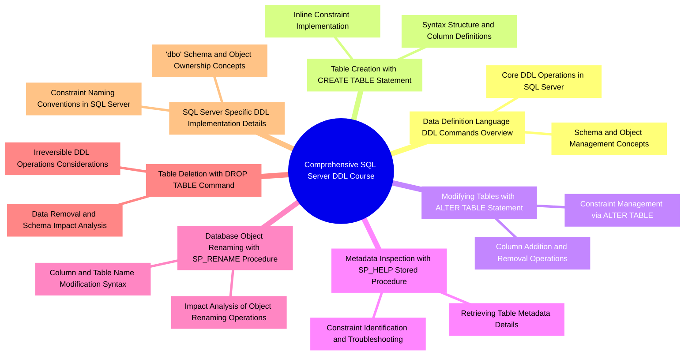

```mermaid
mindmap
root((Comprehensive SQL Server DDL Course))
  topic_ddl_overview[Data Definition Language DDL Commands Overview]
    sub_ddl_core_ops[Core DDL Operations in SQL Server]
    sub_schema_mgmt[Schema and Object Management Concepts]
  topic_table_creation[Table Creation with CREATE TABLE Statement]
    sub_create_syntax[Syntax Structure and Column Definitions]
    sub_inline_constraints[Inline Constraint Implementation]
  topic_table_modification[Modifying Tables with ALTER TABLE Statement]
    sub_add_drop_col[Column Addition and Removal Operations]
    sub_constraint_mgmt_alt[Constraint Management via ALTER TABLE]
  topic_metadata_inspection[Metadata Inspection with SP_HELP Stored Procedure]
    sub_sp_help_metadata[Retrieving Table Metadata Details]
    sub_constraint_debugging[Constraint Identification and Troubleshooting]
  topic_object_renaming[Database Object Renaming with SP_RENAME Procedure]
    sub_rename_syntax[Column and Table Name Modification Syntax]
    sub_rename_impact[Impact Analysis of Object Renaming Operations]
  topic_table_deletion[Table Deletion with DROP TABLE Command]
    sub_drop_table_impact[Data Removal and Schema Impact Analysis]
    sub_ddl_risks[Irreversible DDL Operations Considerations]
  topic_sql_server_specifics[SQL Server Specific DDL Implementation Details]
    sub_dbo_schema['dbo' Schema and Object Ownership Concepts]
    sub_constraint_naming[Constraint Naming Conventions in SQL Server]
```