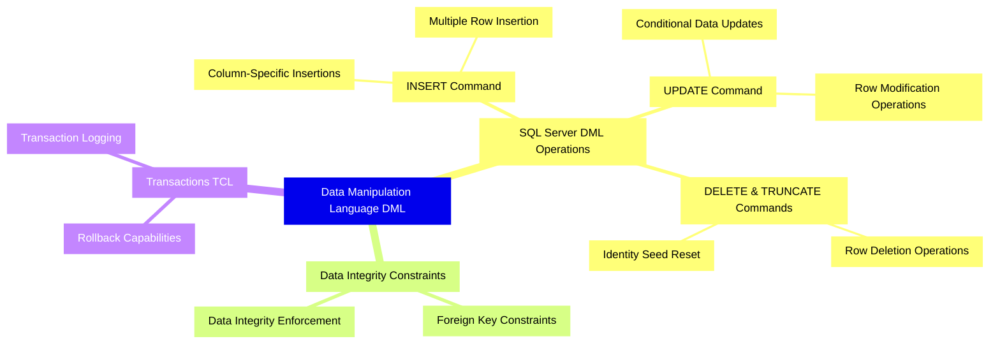

```mermaid
mindmap
  dml_root[Data Manipulation Language DML]
    sql_server_dml[SQL Server DML Operations]
      insert_cmd[INSERT Command]
        column_insert[Column-Specific Insertions]
        multi_row_insert[Multiple Row Insertion]
      update_cmd[UPDATE Command]
        conditional_update[Conditional Data Updates]
        row_mod_ops[Row Modification Operations]
      delete_truncate[DELETE & TRUNCATE Commands]
        row_del_ops[Row Deletion Operations]
        identity_reset[Identity Seed Reset]
    data_integrity[Data Integrity Constraints]
      foreign_keys[Foreign Key Constraints]
      integrity_enf[Data Integrity Enforcement]
    trans_tcl[Transactions TCL]
      rollback_cap[Rollback Capabilities]
      txn_logging[Transaction Logging]
```