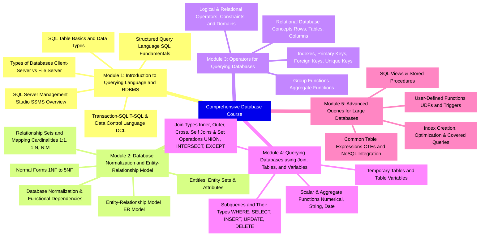

```mermaid
mindmap
  course_root[Comprehensive Database Course]
    mod1_intro_sql[Module 1: Introduction to Querying Language and RDBMS]
      concept_sql_basics[Structured Query Language SQL Fundamentals]
      concept_db_types[Types of Databases Client-Server vs File Server]
      concept_ssms[SQL Server Management Studio SSMS Overview]
      concept_tables_data_types[SQL Table Basics and Data Types]
      concept_tsql_dcl[Transaction-SQL T-SQL & Data Control Language DCL]
    mod2_norm_er[Module 2: Database Normalization and Entity-Relationship Model]
      concept_er_model[Entity-Relationship Model ER Model]
      concept_entity_attrs[Entities, Entity Sets & Attributes]
      concept_relations_cardinality[Relationship Sets and Mapping Cardinalities 1:1, 1:N, N:M]
      concept_normalization[Database Normalization & Functional Dependencies]
      concept_nf_levels[Normal Forms 1NF to 5NF]
    mod3_operators[Module 3: Operators for Querying Databases]
      concept_rel_db[Relational Database Concepts Rows, Tables, Columns]
      concept_operators_constraints[Logical & Relational Operators, Constraints, and Domains]
      concept_indexes_keys[Indexes, Primary Keys, Foreign Keys, Unique Keys]
      concept_group_functions[Group Functions Aggregate Functions]
    mod4_joins_vars[Module 4: Querying Databases using Join, Tables, and Variables]
      concept_joins_set_ops[Join Types Inner, Outer, Cross, Self Joins & Set Operations UNION, INTERSECT, EXCEPT]
      concept_temp_tables[Temporary Tables and Table Variables]
      concept_sql_functions[Scalar & Aggregate Functions Numerical, String, Date]
      concept_subqueries[Subqueries and Their Types WHERE, SELECT, INSERT, UPDATE, DELETE]
    mod5_advanced_queries[Module 5: Advanced Queries for Large Databases]
      concept_views_stored_procs[SQL Views & Stored Procedures]
      concept_udfs_triggers[User-Defined Functions UDFs and Triggers]
      concept_indexes_optimization[Index Creation, Optimization & Covered Queries]
      concept_cte_nosql[Common Table Expressions CTEs and NoSQL Integration]
```