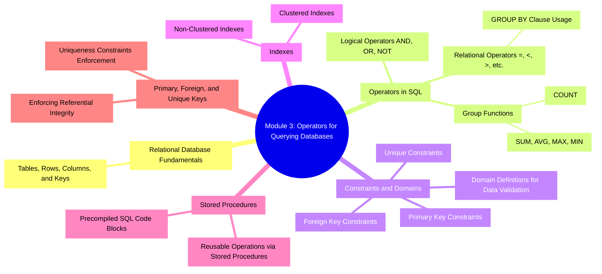

```mermaid
mindmap
  module_3_root((Module 3: Operators for Querying Databases))
    relational_db_fundamentals[Relational Database Fundamentals]
      tables_rows_cols_keys[Tables, Rows, Columns, and Keys]
    sql_operators[Operators in SQL]
      logical_ops[Logical Operators AND, OR, NOT]
      relational_ops[Relational Operators =, <, >, etc.]
        group_by_clause[GROUP BY Clause Usage]
      group_functions[Group Functions]
        count_function[COUNT]
        sum_avg_max_min[SUM, AVG, MAX, MIN]
    constraints_domains[Constraints and Domains]
      primary_key_def[Primary Key Constraints]
      foreign_key_def[Foreign Key Constraints]
      unique_constraints[Unique Constraints]
      domain_definitions[Domain Definitions for Data Validation]
    indexes[Indexes]
      clustered_index[Clustered Indexes]
      non_clustered_index[Non-Clustered Indexes]
    stored_procedures[Stored Procedures]
      precompiled_sql_blocks[Precompiled SQL Code Blocks]
      reusable_operations[Reusable Operations via Stored Procedures]
    keys_constraints[Primary, Foreign, and Unique Keys]
      referential_integrity[Enforcing Referential Integrity]
      uniqueness_enforcement[Uniqueness Constraints Enforcement]
```