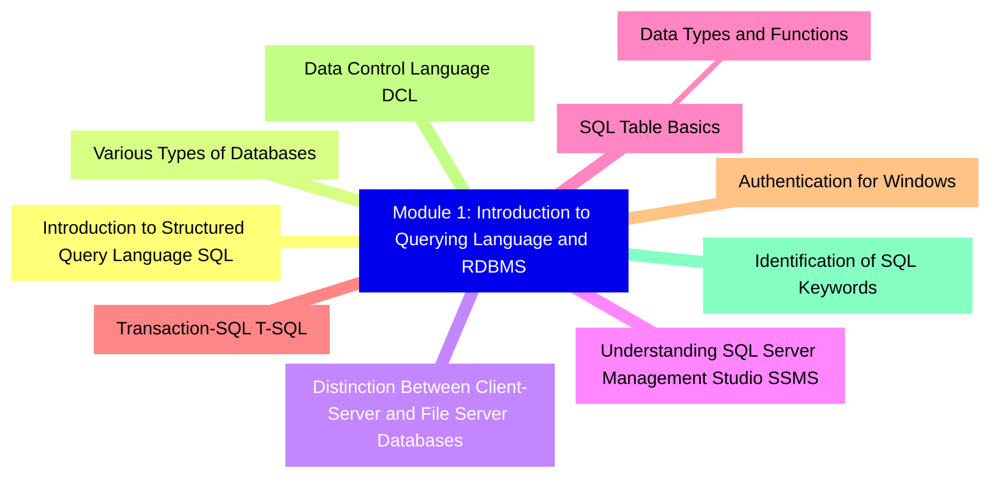

```mermaid
mindmap
  module_1_root[Module 1: Introduction to Querying Language and RDBMS]
    topic_sql_intro[Introduction to Structured Query Language SQL]
    topic_db_types[Various Types of Databases]
    topic_client_server[Distinction Between Client-Server and File Server Databases]
    topic_sql_mgmt_studio[Understanding SQL Server Management Studio SSMS]
    topic_table_basics[SQL Table Basics]
      topic_data_types[Data Types and Functions]
    topic_tsql[Transaction-SQL T-SQL]
    topic_authentication[Authentication for Windows]
    topic_dcl[Data Control Language DCL]
    topic_sql_keywords[Identification of SQL Keywords]
```