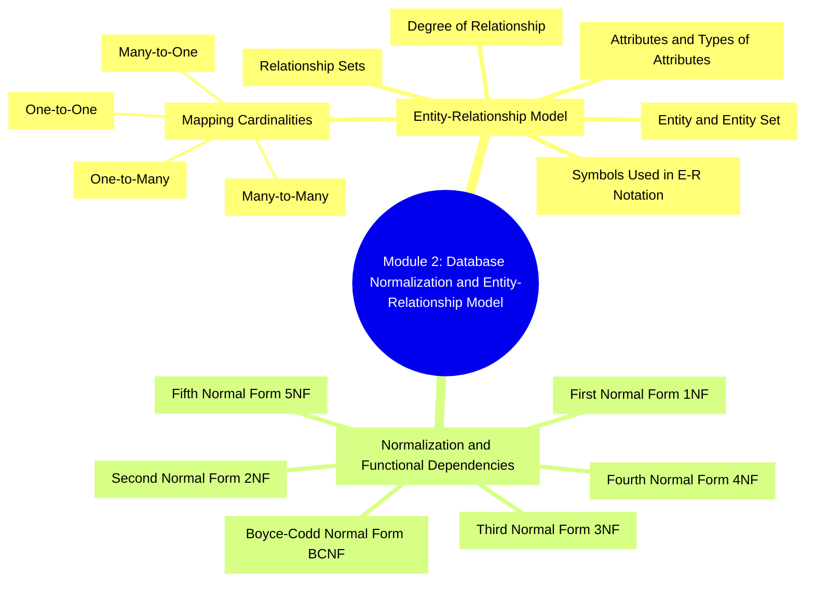

```mermaid
mindmap
  root((Module 2: Database Normalization and Entity-Relationship Model))
    er_model_section[Entity-Relationship Model]
      entity_concept[Entity and Entity Set]
      attributes_concept[Attributes and Types of Attributes]
      relationship_sets[Relationship Sets]
      degree_relationship[Degree of Relationship]
      cardinalities_concept[Mapping Cardinalities]
        one_to_one[One-to-One]
        one_to_many[One-to-Many]
        many_to_one[Many-to-One]
        many_to_many[Many-to-Many]
      er_symbols[Symbols Used in E-R Notation]
    normalization_section[Normalization and Functional Dependencies]
      1nf_normalization[First Normal Form 1NF]
      2nf_normalization[Second Normal Form 2NF]
      3nf_normalization[Third Normal Form 3NF]
      bcnf_normalization[Boyce-Codd Normal Form BCNF]
      4nf_normalization[Fourth Normal Form 4NF]
      5nf_normalization[Fifth Normal Form 5NF]
```