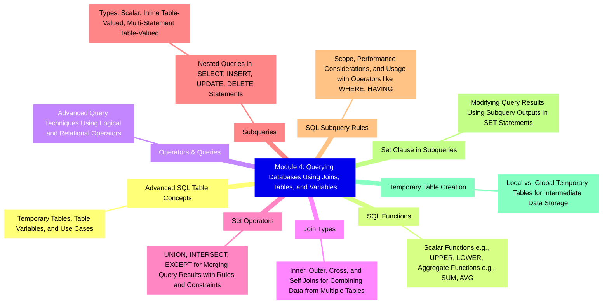

```mermaid
mindmap
    module_4_root[Module 4: Querying Databases Using Joins, Tables, and Variables]
        advanced_sql_tables[Advanced SQL Table Concepts]
            temporary_tables_variants[Temporary Tables, Table Variables, and Use Cases]
        sql_functions[SQL Functions]
            scalar_aggregate_functions[Scalar Functions e.g., UPPER, LOWER, Aggregate Functions e.g., SUM, AVG]
        operators_queries[Operators & Queries]
            logical_relational_operators[Advanced Query Techniques Using Logical and Relational Operators]
        join_types[Join Types]
            inner_outer_cross_self_joins[Inner, Outer, Cross, and Self Joins for Combining Data from Multiple Tables]
        set_operators[Set Operators]
            union_intersect_except[UNION, INTERSECT, EXCEPT for Merging Query Results with Rules and Constraints]
        subqueries[Subqueries]
            nested_subqueries_select_insert_update_delete[Nested Queries in SELECT, INSERT, UPDATE, DELETE Statements]
                scalar_inline_multi_statement_table_valued[Types: Scalar, Inline Table-Valued, Multi-Statement Table-Valued]
        sql_subquery_rules[SQL Subquery Rules]
            subquery_scope_performance_usage_operators[Scope, Performance Considerations, and Usage with Operators like WHERE, HAVING]
        set_clause_subqueries[Set Clause in Subqueries]
            modifying_query_results_set_statements[Modifying Query Results Using Subquery Outputs in SET Statements]
        temp_table_creation[Temporary Table Creation]
            local_global_temp_tables[Local vs. Global Temporary Tables for Intermediate Data Storage]
```