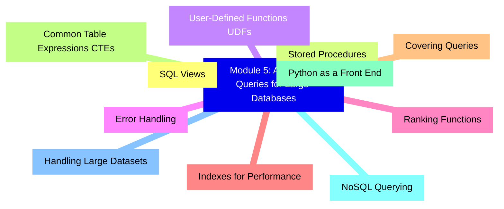

```mermaid
mindmap
    module_5[Module 5: Advanced Queries for Large Databases]
      sql_views[SQL Views]
      stored_procedures[Stored Procedures]
      udfs[User-Defined Functions UDFs]
      error_handling[Error Handling]
      ranking_functions[Ranking Functions]
      indexes_performance[Indexes for Performance]
      covering_queries[Covering Queries]
      ctes[Common Table Expressions CTEs]
      python_integration[Python as a Front End]
      nosql_querying[NoSQL Querying]
      handling_large_datasets[Handling Large Datasets]
```