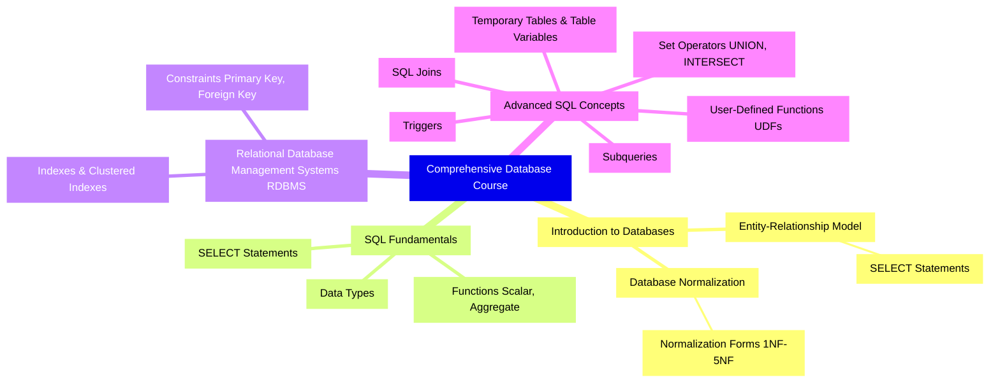

```mermaid
mindmap
course_root[Comprehensive Database Course]
  mod_intro_db[Introduction to Databases]
    concept_rel_model[Entity-Relationship Model]
      subtopic_select[SELECT Statements]
    concept_norm[Database Normalization]
      subtopic_norm_forms[Normalization Forms 1NF-5NF]
  mod_sql_fundamentals[SQL Fundamentals]
    subtopic_data_types[Data Types]
    subtopic_functions[Functions Scalar, Aggregate]
    subtopic_select[SELECT Statements]
  mod_rdbms[Relational Database Management Systems RDBMS]
    subtopic_constraints[Constraints Primary Key, Foreign Key]
    subtopic_indexing[Indexes & Clustered Indexes]
  mod_advanced_sql[Advanced SQL Concepts]
    subtopic_joins[SQL Joins]
    subtopic_subqueries[Subqueries]
    subtopic_udfs[User-Defined Functions UDFs]
    subtopic_triggers[Triggers]
    subtopic_temp_tables[Temporary Tables & Table Variables]
    subtopic_set_ops[Set Operators UNION, INTERSECT]
```