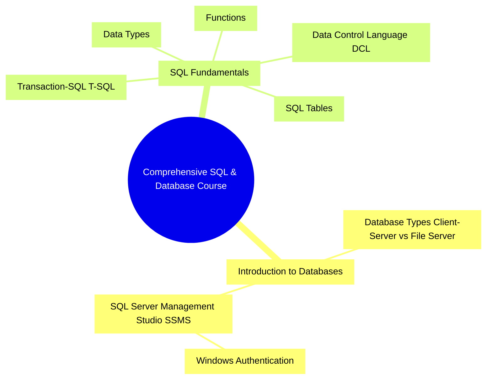

```mermaid
mindmap
root((Comprehensive SQL & Database Course))
    mod_databases_intro[Introduction to Databases]
        concept_db_types[Database Types Client-Server vs File Server]
        tool_ssms[SQL Server Management Studio SSMS]
            security_auth[Windows Authentication]
    mod_sql_fundamentals[SQL Fundamentals]
        concept_sql_tables[SQL Tables]
        concept_data_types[Data Types]
        concept_functions[Functions]
        dialect_tsql[Transaction-SQL T-SQL]
        concept_dcl[Data Control Language DCL]
```