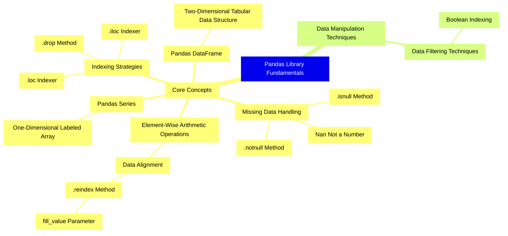

```mermaid
mindmap
pandas_root[Pandas Library Fundamentals]
  mod_pandas_core[Core Concepts]
    concept_series[Pandas Series]
      sub_one_dim_array[One-Dimensional Labeled Array]
    concept_dataframe[Pandas DataFrame]
      sub_two_dim_table[Two-Dimensional Tabular Data Structure]
    mod_missing_data[Missing Data Handling]
      sub_nan_value[Nan Not a Number]
      method_isnull[.isnull Method]
      method_notnull[.notnull Method]
    mod_arithmetic_ops[Element-Wise Arithmetic Operations]
      concept_data_alignment[Data Alignment]
        method_reindex[.reindex Method]
          param_fill_value[fill_value Parameter]
    mod_indexing_strats[Indexing Strategies]
      method_loc[.loc Indexer]
      method_iloc[.iloc Indexer]
      method_drop[.drop Method]
  mod_data_manipulation[Data Manipulation Techniques]
    mod_filtering[Data Filtering Techniques]
      technique_boolean_idx[Boolean Indexing]
```