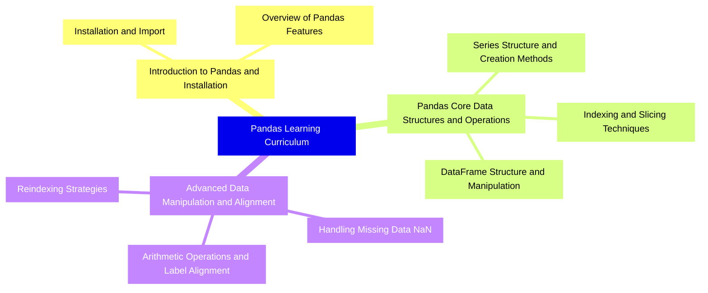

```mermaid
mindmap
  pandas_course_root[Pandas Learning Curriculum]
    mod_intro_pandas[Introduction to Pandas and Installation]
      sub_install_import[Installation and Import]
      sub_features_overview[Overview of Pandas Features]
    mod_core_structures[Pandas Core Data Structures and Operations]
      sub_series_creation[Series Structure and Creation Methods]
      sub_dataframe_manipulation[DataFrame Structure and Manipulation]
      sub_indexing_techniques[Indexing and Slicing Techniques]
    mod_advanced_ops[Advanced Data Manipulation and Alignment]
      sub_missing_data_handling[Handling Missing Data NaN]
      sub_arithmetic_alignment[Arithmetic Operations and Label Alignment]
      sub_reindexing_strats[Reindexing Strategies]
```